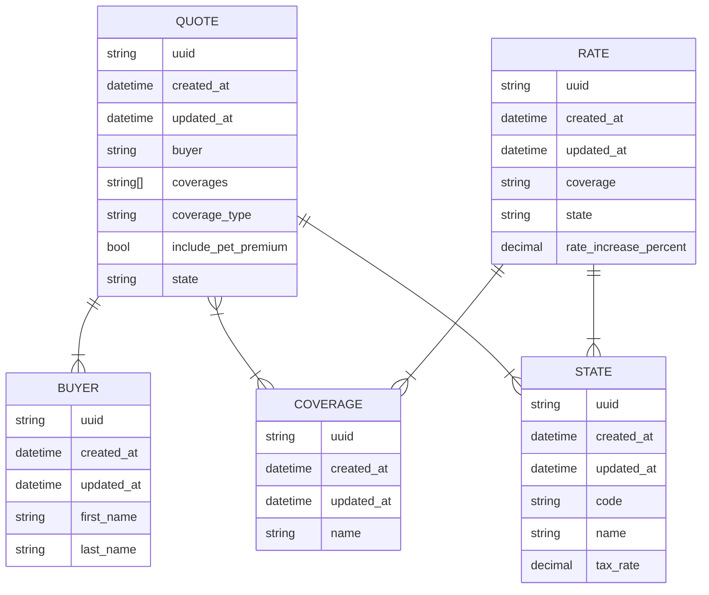

# Acme Home Insurance
#### Daniel Sokol
#### Take Home Assement
#### Oct 14 2023

#
### General Notes
- This application is a backend-only application that leverages Django and Django REST Framework. 
- Interactions are done through standard REST calls.
- This application includes swagger (and redoc) documentation for a detailed explanation of the API.
- This application also incldues (some) test cases, a code coverage report, and is containerized for ease of use.

#
### Activation
#### Option 1) Docker
1) Build application by running 
```
docker-compose build
docker-compose up
```
2) Go to http://localhost:8000/docs in the browser
<br><br>
Notes: the docker container is set up to run the app in dev/debug mode; a different docker file should/would be used in production. The **docker-compose.yaml** file will also need updating for production mode.

#
#### Option 2) Virtual Environment
1) Create and activrate venv 
```
python3 -m venv .venv
source .venv/bin/activate
```
2) Install requirements 
```
pip install -r requirements.txt
```
3) Start the dev server 
```
python manage.py runserver
```
4) go to http://localhost:8000/docs in the browser
<br><br>
Notes: project was built with python3.8, other versions may not be compatable

#
### Testing
- Tests can be found in **quotes/test.py**
- Code coverage can be found by opening **htmlcov/index.html** in the browser
- Test cases can be run with
```
docker-compose up test
```
- Or directly from the venv: 
```
python manage.py test
```

#
### Entities
Note, this section requires mermiad to render properly


#### Buyer
- Represents an individual for whom quotes are generated
#### Coverage
- The type of coverage, simply a name, i.e. "Flood"
#### Quote
- The quote for a given buyer, in a particular state, with different coverage parameters, including the list of coverages
#### Rate
- The tax rate for a type of coverage in a given state
#### State
- The state and its associated tax percentage

#
### Examples
1) Add a new `State`
```
curl -X POST -H "Content-Type: application/json" -d '{"code": "CA", "name": "California", "taxRate": 2.5}' http://localhost:8000/api/states/
```
2) Update a `Rate`
```
curl -X PATCH -H "Content-Type: application/json" -d '{"rateIncreasePercent": 12.0}' http://localhost:8000/api/rates/19a205fd-ecff-4c7b-9012-337b9c8530f5/
```
3) Get a `Quote` and calculate price
```
curl -X GET http://localhost:8000/api/quotes/29737db0-c7bf-4ba1-b37c-acf98993222f/calculate-price/
```